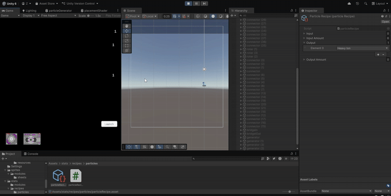
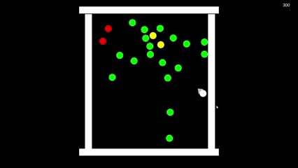
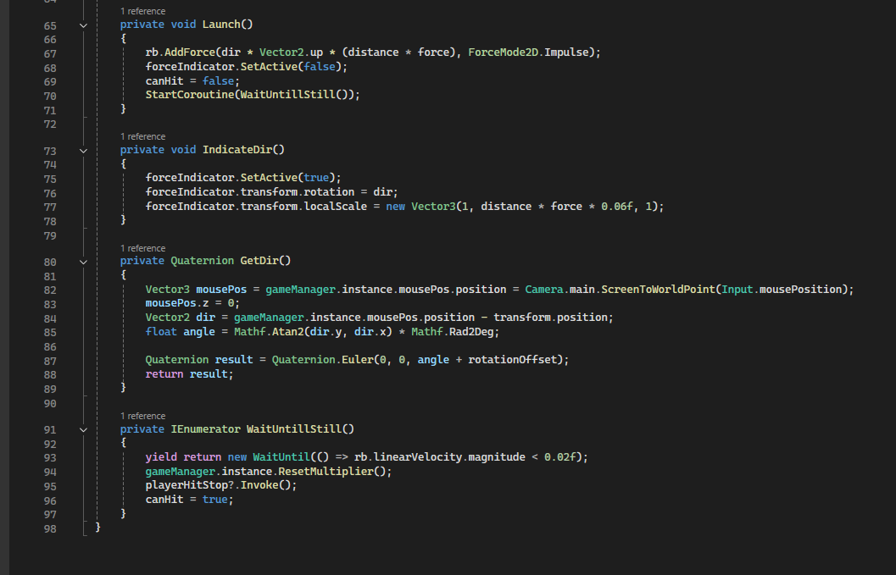
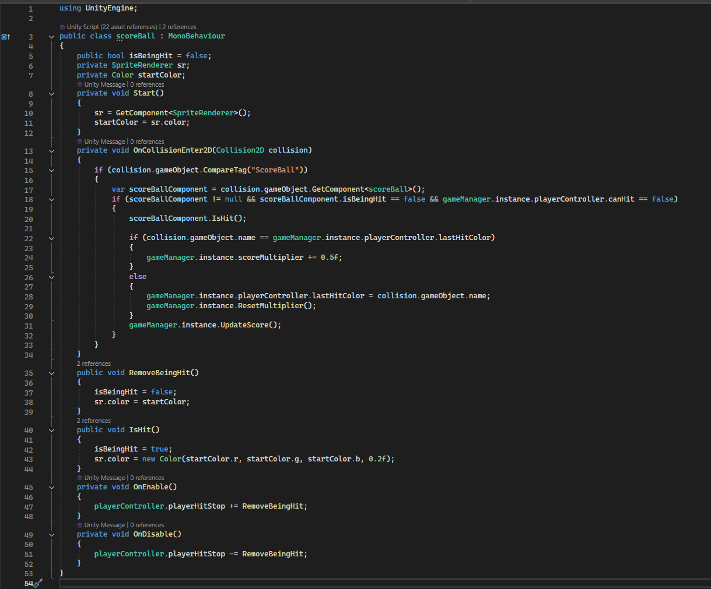
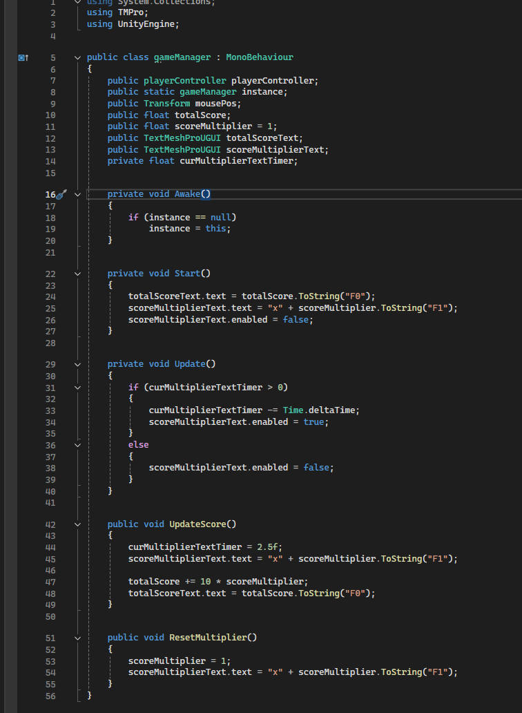

# GDV

## M2
### les 1

Hier heb ik een systeem voor het genereren van deeltjes.

Het genereert alleen zware ionen.
Maar ik kan elektronen toevoegen aan het scriptbare objectrecept in de inspecteur (het gebruikt lijsten en hun indexen om deeltjes te identificeren).

Hier is het resultaat.

### School project 1
Project is in Releases - project 1.

Dit is een sort van biljard spel.

In dit je krijgt meer score met elke bal je of andere geactiveerd bal raakt. Key feature is dat met elke bal van hetzelfde kleur je activeerd je krijgt score multiplier +0.5. 

Code is heel simpel.

In Update method is heel simpel controller. Alle andere methoden zijn gewoon berekeningen.

Dan code voor elke gekleurde bal op het scene:

Score berekeningen gaat door game manager:
